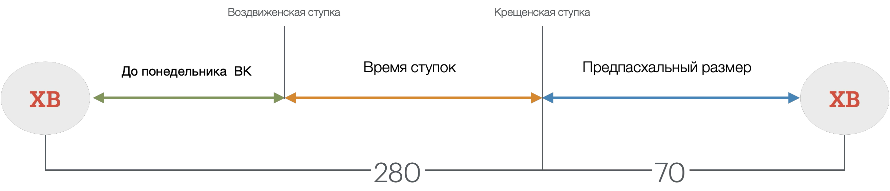
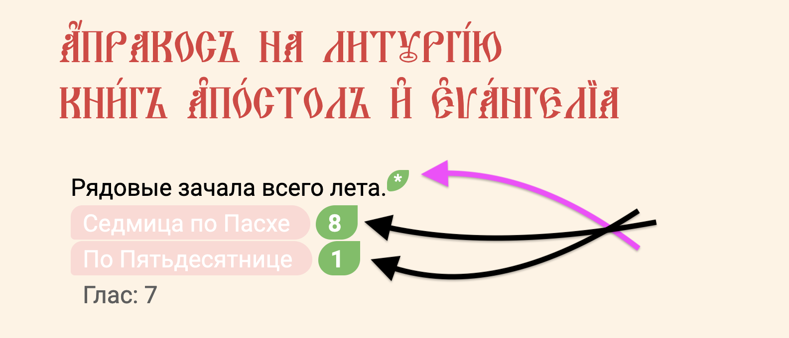

#  Упрощенное понимание и как пользоваться сайтом

На странице древа жизни указаны все рядовые зачала, которые положены для чтения на литургии на промежуток времени от Пасхи до Пасхи и это `OLY`. Каждая ссылка ведёт на страницу с одним Апостольским зачалом и одним Евангельским зачалом – на страницы, которые неизменяемы. Всего представленных дней для чтения триста пядьдесят. Таким образом получается пятьдесят седмиц по семь дней и на каждый день по два зачала. То есть семьсот обязательных зачал для чтения. 

Пасха же всегда приходится на разные даты гражданского календаря и продолжительность Пасхального года всегда разная (51,54  или 55 седмиц). Если в пасхальном году ровно триста пядьдесят дней и Пасха Приходится на дату, от которой через двадцать четыре седмицы будет праздник Воздвижения Креста Господня, тогда Апракос будет читаться последовательно день за днём без корректировок. 

#### Если в пасхальном богослужебном году более трёхсот пядьдесяти дней, например триcта восемьдесят пять (55 седмиц), тогда требуется корректировка последовательности чтения с повторениями уже ранее прочитанных зачал.  это значит, что будут прочитанные положенные 280 зачал Евангелия, которых положены только на 40 седмиц и далее понадобится повтор последних пяти седмиц. Это значит, что повтор начнётся c 35-й седмицы и закончится на 40-й. Далее будут читаться не корректирующися седмицы великопостного размера, в которой входят три подготовительные седмицы и седмицы святой четыредесятницы. Всего 70 дней, после которых наступает Пасха. Данное правило действительно только для зачал Евангелия, именно по ним корректируются отступки и приступки чтения. Апостольские же зачала следуют последовательно друг за другом без корректировок, но поскольку их тоже только 350, то и они требуют повторения при богослужебном годе, превышающим 50 седмиц.

На данном сайте воспроизведена попытка создать последовательность чтений в соответствии с уставом Православной Церкви, или – если точнее сказать: с одним из вариантов чтения по зачалам. Существуют определённые правила, которые указывают на какие даты и какие дни календаря  нужно читать зачала. Также указано до какого дня их читать, или с какого дня начинать читать определённые зачала. Не подготовленного человека такая странная последовательность может сбивать с толку. Наша задача объяснить как пользоваться сайтом с пониманием. Мы постарались сделать максимально простым способом данное чтение.

Когда вы попадаете на страницу `Древо жизни`, тогда перед вами находятся все зачала Пасхального Богослужебного Года (ПБГ). 

Вверху страницы указаны два пункта: это седмица по Пасхе и седмица по Пятидесятнице. Рядом с этими названиями указаны числа текущих седмиц. Первое число показывает сколько седмиц прошло после Пасхи. Второе число указывает на то, сколько прошло седмиц после Пятидесятницы. Разница между этими числами всегда равна семи. Оба этих числа являются ссылками. Первое число является ссылкой на 
Апостольское зачало, а второе число является ссылкой на Евангельское зачало для текущего дня. Звездочка рядом с числом седмицы по Пасхе покажет вам номер седмицы, на которую приходится читаемое евангельское зачало c учётом корректировки. Такая система чтений называется Апракос. 

Если в пасхальном году больше 350 дней, тогда в определённый момент времени ссылки с этих чисел буду указывать на те зачала, которые нужно читать именно в эти дни. Если вы видите что зачала разошлись в разные седмицы, это значит что в действие вступила ступка. 

**Ступка**  может быть двух видов – отступкой или преступкой. Такая ступка называется Воздвиженской, она зависит от даты начала Пасхального года, то есть от даты Пасхи, которая фиксируется в гражданском календаре. 

После Пасхи вступает в действие первый промежуток времени, который длится до воздвижения креста Господня. После того как наступит праздник Воздвижение креста Господня, а это 27-й сентября, после него в первый понедельник после этой даты начинается второй промежуток чтения и для него установленны свои зачала. Этот промежуток длится до момента времени, в которой также начинаются читаться зачала Великого поста и его подготовительного периода. Таким моментом времени назначен 70-й день до ожидаемой Пасхи. Этот 70-й день называется Неделя о Мытаре и Фарисее.

Таким образом последовательное чтение зачал всегда стабильны от Пасхи до 20-ой седмицы и в промежуток времени в размере 10-ти седмиц перед Пасхой. 

Если апостольские зачала всегда следуют строго последовательно, то во второй промежуток времени евангельские зачала требуют корректировки, эти корректировки называются  преступками или отступками. 70-й день до Пасхи все корректировки заканчиваются. Таким днём является Воскресенье (Неделя) Мытаря и Фарисея.

Таким образом у вас на странице будут всегда основные две ссылки. Это два выделенных зачала – одно апостольское зачало, другое евангельское зачало.

Клики по заголовкам направляют от древа к страницам апракосных евангельских зачал и возвращают обратно к древу. 
Звездочка * всегда покажет число **Апракосной Евангельской Седмицы** – она же Седмица Евангелия. 

Если в древе жизни седмица Евангелия, которая подсвечена красным находится ниже седмицы апостола, которая подсвечена синим значит действует преступка. 

Если же евангельскаяседмица находится выше апостольской седмицы значит действует отступка.

